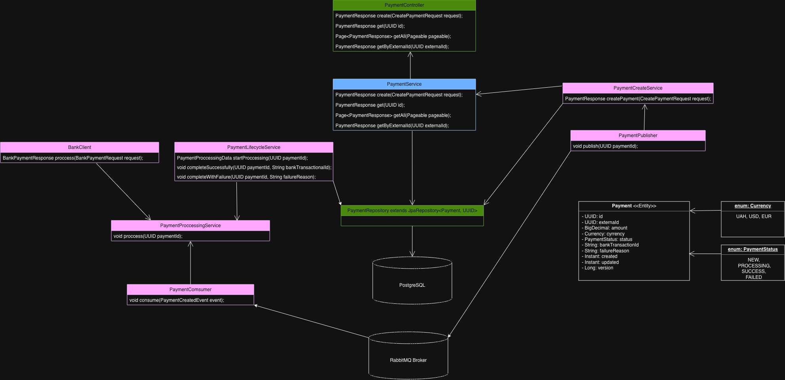

# Payment Processing Service

## Overview

Payment Processing Service is a Spring Boot application that simulates payment processing using PostgreSQL and RabbitMQ.

## Technologies
 - Java 21
 - Spring Boot 3
 - Spring Data JPA
 - PostgreSQL
 - RabbitMQ
 - Docker Compose
 - Liquibase
 - JUnit 5
 - Mockito
 - Testcontainers
 - Swagger / OpenAPI
 - Spring Boot Actuator

## Requirements
 - Java 21
 - Maven 3.9+
 - Docker
 - Docker Compose


## Clone Project
```bash
git clone <repository-url>

cd payment-processing-service
```

## Configuration

Copy the example environment file:
```bash
cp .env.example .env
```

## Start infrastructure
```bash
docker compose up -d
```
### This command starts:
- PostgreSQL
- RabbitMQ

### RabbitMQ Management UI:
**URL:** http://localhost:15672

**Username:** guest

**Password:** guest


## Build project
```bash
mvn clean install
```

## Run application
```bash
mvn spring-boot:run
```

### or

```bash
java -jar target/payment-processing-service.jar
```


## Swagger
**URL:** http://localhost:8080/swagger-ui/index.html


## Run tests
```bash
mvn test
```


## API
### Create payment
```http request
POST /api/v1/payments
```
##### Example

```json
{
  "externalId": "e5deed0d-a3a5-42c8-92af-f0d7f16dcdd5",
  "amount": 150.00,
  "currency": "UAH"
}
```

### Get payment
```http request
GET /api/v1/payments/{id}
```

### Get payment by externalId
```http request
GET /api/v1/payments/external/{externalId}
```

### Get all payments
```http request
GET /api/v1/payments
```

## Actuator

The application exposes Spring Boot Actuator endpoints.

**Base URL:**  http://localhost:8080/actuator

Common endpoints:
```
- /actuator/health
- /actuator/info
- /actuator/metrics
- /actuator/env
- /actuator/mappings
```

## UML Diagram
The UML diagram describing the project architecture can be found here:

**URL:** https://drive.google.com/file/d/1SL7XNYRdOA-Z29GaKJHqrdmLb0Yw6yXy/view?usp=sharing

or



## Architecture
```
REST Controller
        │
        ▼
 PaymentService
        │
        ▼
PaymentCreateService
        │
        ▼
    PostgreSQL
        │
        ▼
 Publish Event
        │
        ▼
    RabbitMQ
        │
        ▼
 PaymentConsumer
        │
        ▼
 FakeBankClient
        │
        ▼
 Update Payment
        │
        ▼
    PostgreSQL
```

## Notes
- Liquibase automatically creates the database schema.
- Payment processing is asynchronous via RabbitMQ.
- Duplicate payments are prevented by a unique constraint on `external_id`.
- Unique constraint on external_id guarantees idempotent payment creation.
- Optimistic locking (@Version) protects concurrent updates.
- FakeBankClient simulates an external banking API.

## Features
- Create payment
- Retrieve payment by ID
- Retrieve payment by external ID
- Retrieve all payments
- Asynchronous payment processing
- RabbitMQ integration
- PostgreSQL persistence
- Liquibase database migrations
- Integration tests with Testcontainers
- Health and monitoring

## Payment lifecycle
1. Client sends a payment creation request.
2. Payment is stored in PostgreSQL.
3. A payment event is published to RabbitMQ.
4. The consumer receives the event.
5. FakeBankClient simulates payment processing.
6. The payment status is updated.
